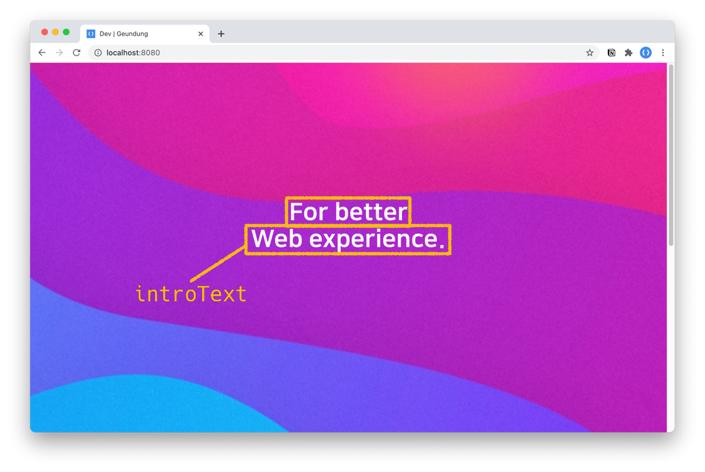
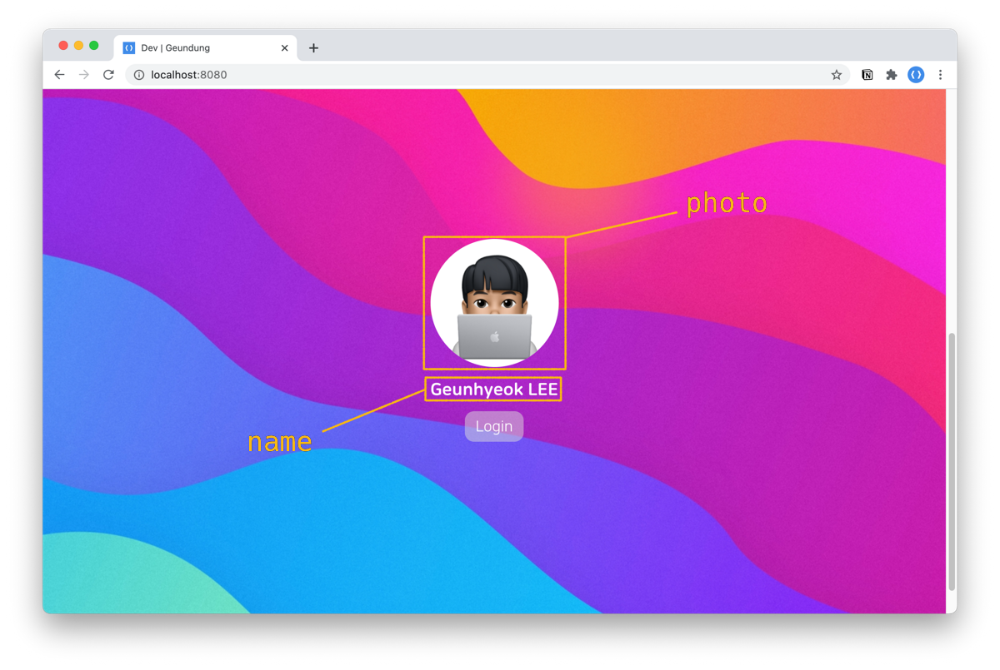
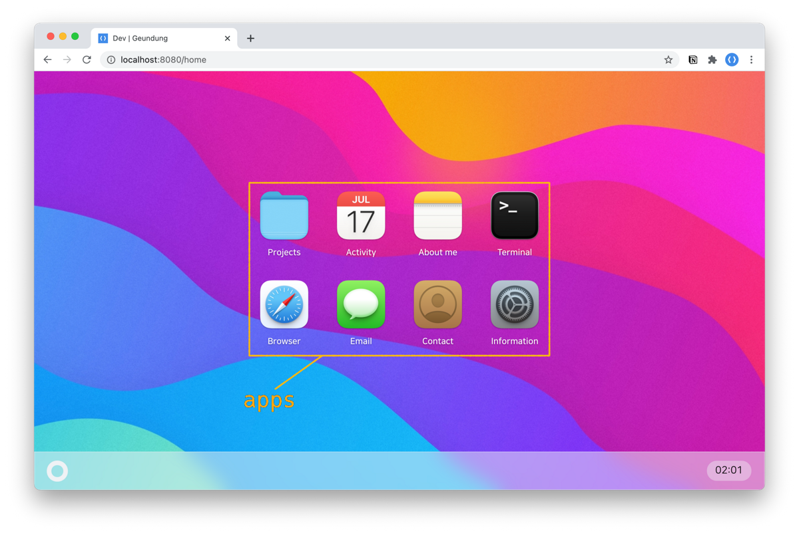
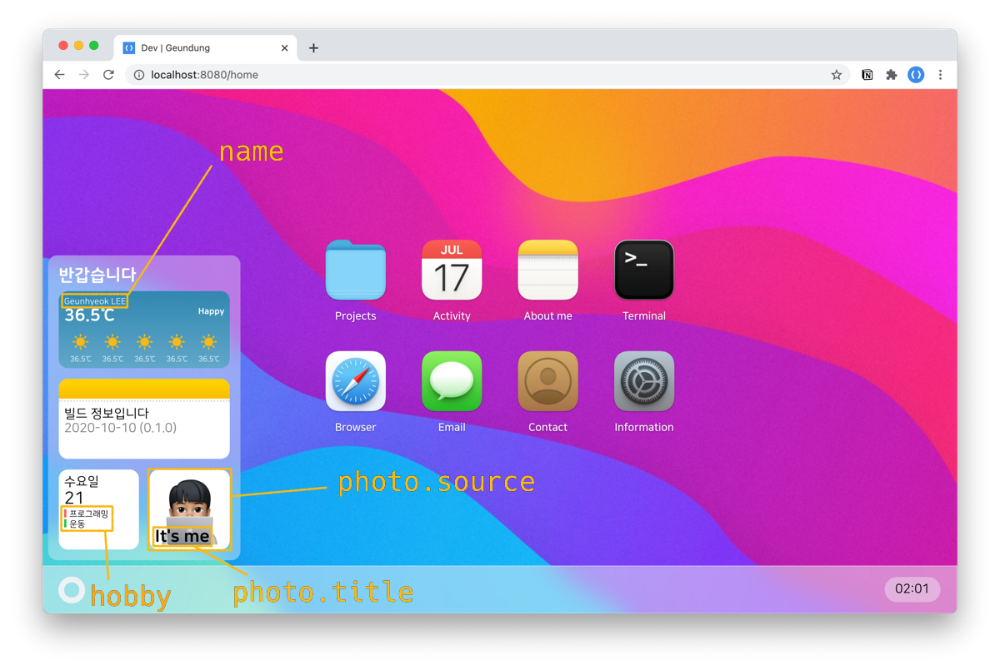

<div align="center">

# 🍀 Résume

WIP...

  
  <br>
  

Geunhyeok's resume template. [show](https://this.geundung.dev)

</div>

## 👀 Preview


- macOS 11 Big Sur style 🍎
- Fully responsive design 📱
- PWA Support 🔥

## 👨‍💻 Browser support

## 👨‍💻 Tech stacks

Using [Vue 3](https://github.com/vuejs/vue-next) with [TS](https://github.com/microsoft/TypeScript)! ❤️

<code></code>
<code></code>
<code></code>
<code></code>

and also included vuex, vue-router

## Template Docs

### 🐥 HTML Basics

Check `vue.config.js` or `public/index.html`.

```js
module.exports = {
  productionSourceMap: false,
  publicPath: process.env.NODE_ENV === 'development' ? '/' : '/dist',
  chainWebpack: config => {
    config.plugin('html').tap(args => {
      args[0].title = 'Dev | Geundung'; // <-- HTML Title
      args[0].ga = 'UA-156696575-2'; // <-- Google Analytics Code
      return args;
    });
  },
};
```

### 👋 Intro page

Check `src/components/pages/Main.vue`.

```js
const Template = {
  name: 'NAME',
  photo: require('@/assets/IMAGE'),
  introText: ['TEXT 1', 'TEXT 2'],
};
```

```ts
interface IntroTemplate {
  name: string;
  photo: any; // require('path')
  introText: string[];
}
```

|  Property   | Description                      |               Example               |
| :---------: | :------------------------------- | :---------------------------------: |
|   `name`    | Profile name                     |           `Geunhyeok LEE`           |
|   `photo`   | Profile photo (with `require()`) |  `require('@/assets/avatar.png')`   |
| `introText` | Intro text (each line)           | `['For better', 'Web experience.']` |




### 🏠 Desktop page

Check `src/components/pages/Home.vue`.

```js
// Template

const Template: DesktopTemplate = {
  apps: [
    {
      type: 'APP_TYPE',
      name: 'APP_NAME',
      icon: require('@/assets/app/IMAGE'),
      ...
    }
  ],
  dock: {
    name: 'NAME',
    hobby: ['HOBBY 1', 'HOBBY 2'],
    photo: {
      source: require('@/assets/IMAGE'),
      title: "TITLE",
    },
  },
}
```

```ts
interface App {
  type: string;
  name: string;
  icon: string;
}

export interface ListApp extends App {
  type: 'list';
  items: List[];
}

export interface PageApp extends App {
  type: 'page';
  content: Content[];
}

export interface LinkApp extends App {
  type: 'link';
  url: string;
}

interface DesktopTemplate {
  apps: (ListApp | PageApp | LinkApp)[];
  dock: {
    name: string;
    hobby: string[];
    photo: {
      source: any; // require('path')
      title: string;
    };
  };
}
```

|      Property       | Description                     |             Example              |
| :-----------------: | :------------------------------ | :------------------------------: |
|       `apps`        | Apps list(Max: 8)               |          [here](#apps)           |
|       `dock`        | Dock config                     |                                  |
|     `dock.name`     | Name at weather                 |         `Geunhyeok LEE`          |
|    `dock.hobby`     | Hobbies at calendar (Max: 2)    |     `['프로그래밍', '운동']`     |
| `dock.photo.source` | Image source (with `require()`) | `require('@/assets/avatar.png')` |
| `dock.photo.title`  | Image title                     |            `It's me`             |




## 🎁 Apps

WIP..

---

## 🛠 Project setup

```
npm install
```

### Compiles and hot-reloads for development

```
npm run serve
```

### Compiles and minifies for production

```
npm run build
```

### Lints and fixes files

```
npm run lint
```

### Customize configuration

See [Configuration Reference](https://cli.vuejs.org/config/).

## 🎨 Resources

- macOS 11 style icons by [octaviotti](https://www.deviantart.com/octaviotti).
- Wallpaper image by [ultralinx](https://theultralinx.com/2018/11/gradient-wave-wallpaper-by-ultralinx).
- Weather sun icon from [myiconfinder](http://www.myiconfinder.com/icon/sun-heat-hot-weather-summer-sunshine/22781).

## ⭐️ License

Developed by [Geunhyeok LEE](https://github.com/leegeunhyeok)

- [MIT](./LICENSE) License.
