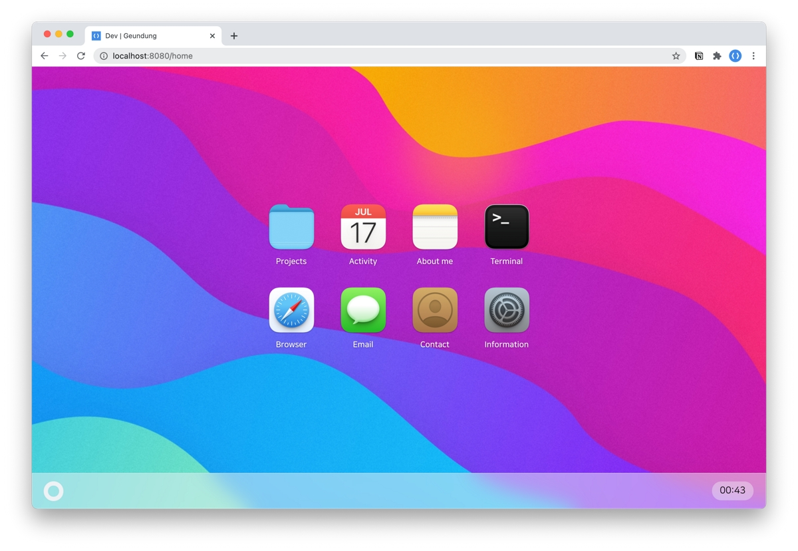
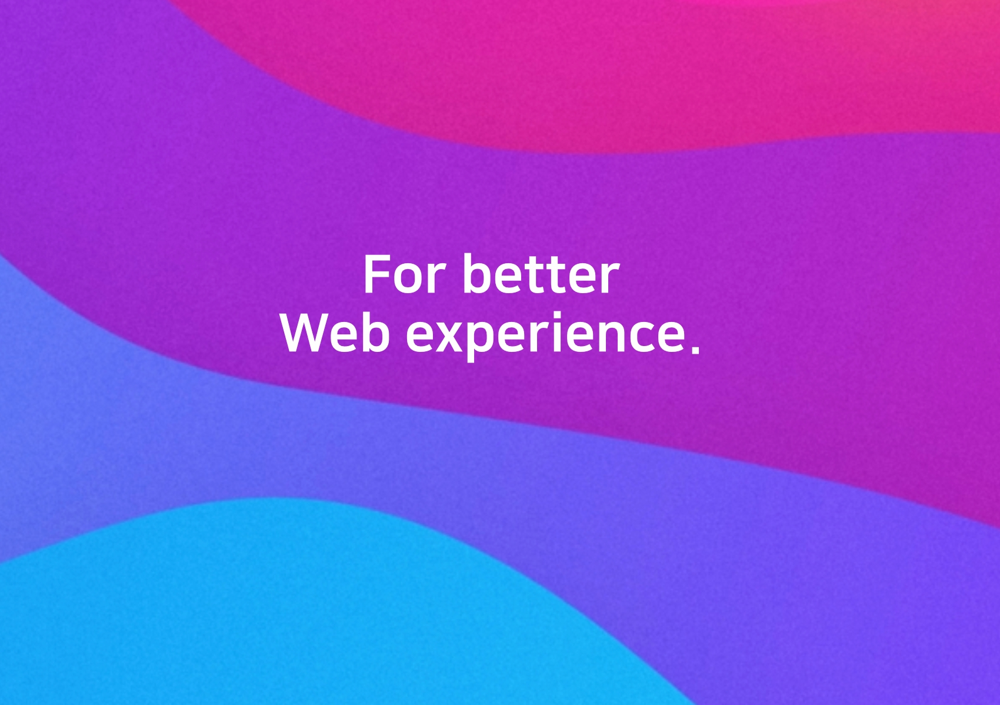
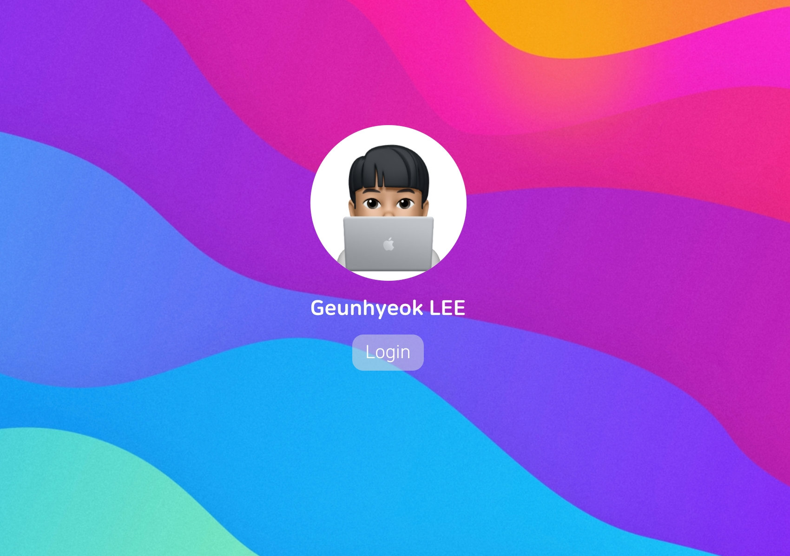
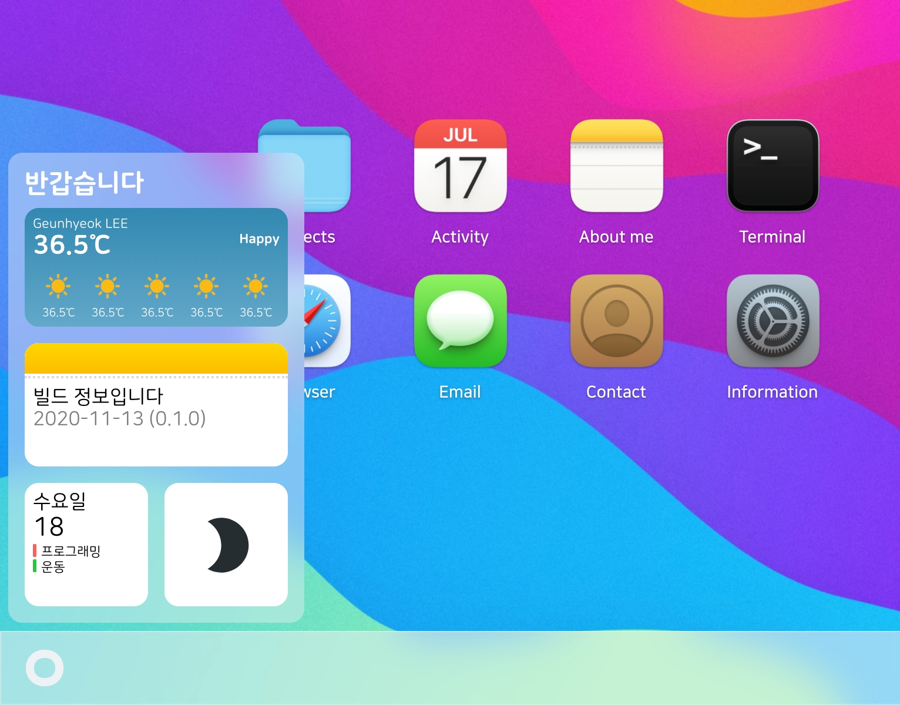
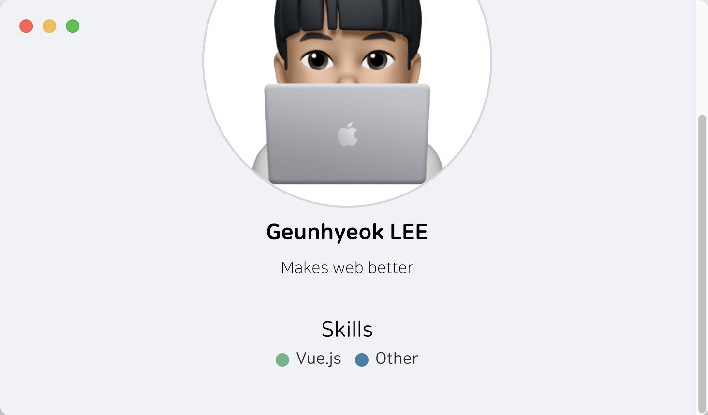
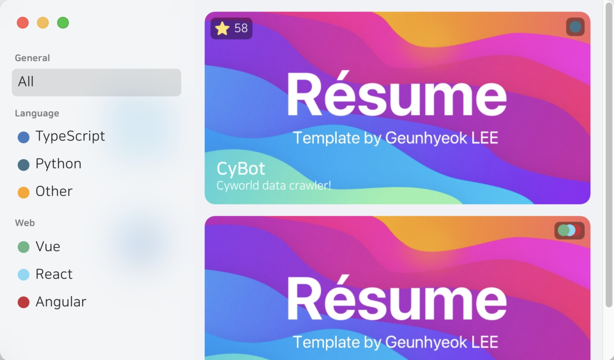
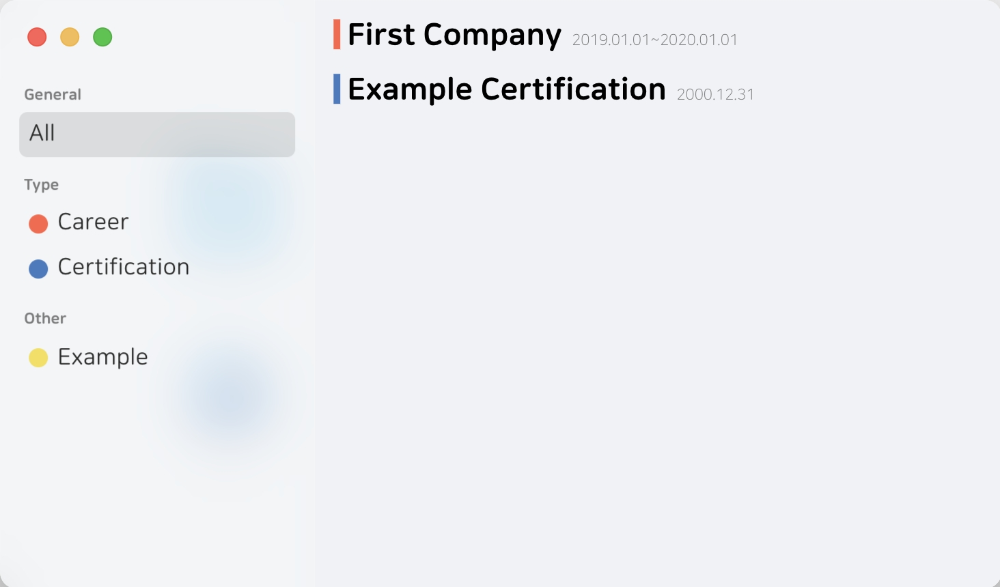
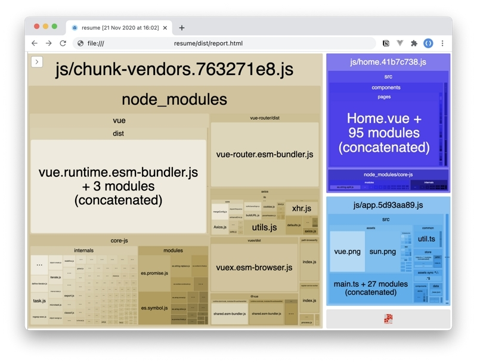

<div align="center">

# Résume

  
  <br>


  

Geunhyeok's resume template. [Demo](https://this.geundung.dev)

---




</div>

- [x] macOS 11 Big Sur style 🍎
- [x] Fully responsive design 📱
- [x] Support darkmode 🌚
- [x] Auto load stars from Github repository ⭐️
- [x] Own contents customizing 🎉
- [x] HTML meta & og tag as template 👀
- [x] PWA Support 🔥
- [x] User friendly documentation 🥰
- [ ] Show alert when usign legacy browser (`< IE11`)
- [ ] Support `SSR` or `static` page via [Nuxt.js](https://github.com/nuxt/nuxt.js). (Waiting for Vue 3 support)

## Contents

1. [Template configuration](#-template-configuration)
2. [Deploy](#-deploy)
3. [Update](#-update)
4. [Development](#-project-setup)

## 🌍 Browser support

WIP...

## 👨‍💻 Tech stacks

Using [Vue 3](https://github.com/vuejs/vue-next) with [TS](https://github.com/microsoft/TypeScript)! ❤️

<code></code>
<code></code>
<code></code>
<code></code>

and also included vuex, vue-router

## 📖 Template Configuration

- [Base](#base) (Template: [src/data/\_base.json](src/data/_base.json))
- [Project](#project-app) (Template: [src/data/project.json](src/data/project.json))
- [Activity](#activity-app) (Template: [src/data/activity.json](src/data/activity.json))
- [Other](#other)

## 🚀 Deploy

- 👉 [Github Page](docs/DEPLOY_GITHUB_PAGE.md)
- 👍 Manually

## 🆕 Update

- ⚠️ WARNING: Backup your data first
  - `src/data/*`
  - `src/assets/contents/*`

```bash
# 1. Add origin template repository to remote (name: template)
git remote add template https://github.com/leegeunhyeok/resume.git

# 2. Fetch all
git fetch --all

# 3. Merge latest template sources
git merge -X theirs --squash --allow-unrelated-histories template/master

# 4. Rollback your template datas
git reset -- src/data
git checkout src/data

# If you want rollback more data, follow this example
# Result: Rollback README.md
# git reset -- README.md
# git checkout README.md

# !! Check your template data before commit !!
# 5-1. (On Success 🎉)  Keep going
git commit -m "Update to latest version"


# 5-2. (Issue occurs ❗) Reset to previous commit (Return to initial state)
git reset --hard HEAD~

# 6. And rebuild/push
```

### Base

Base configuration: [src/data/\_base.json](src/data/_base.json)

| Property                 | Description                                                                                                      |               Example               |
| :----------------------- | :--------------------------------------------------------------------------------------------------------------- | :---------------------------------: |
| `publicPath`             | Webpack [publicPath](https://webpack.js.org/guides/public-path) (If you run `build:github`, override to `/dist`) |                 `/`                 |
| `app`                    | PWA Configuration                                                                                                |                  -                  |
| `app.name`               | PWA Name                                                                                                         |              `Résume`               |
| `app.startUrl`           | Web app manifest's start_url                                                                                     |                 `/`                 |
| `title`                  | Web title (in head)                                                                                              |      `Résume | Geunhyeok LEE`       |
| `ga`                     | Google analytics tracking ID (Optional)                                                                          |          `UA-000000000-0`           |
| `introText[]`            | Intro text (Each line), og description                                                                           | `["For better", "Web experience."]` |
| `profile`                | Your profile informations                                                                                        |                  -                  |
| `profile.name`           | Name                                                                                                             |           `Geunhyeok LEE`           |
| `profile.email`          | Email                                                                                                            |        `dev.ghlee@gmail.com`        |
| `profile.photo`          | Profile photo filename at `src/assets`                                                                           |            `avatar.png`             |
| `profile.introduce`      | Introduce your self                                                                                              |         `Makes web better`          |
| `profile.social[]`       | Social informations in Contact app ([more](#social))                                                             |                  -                  |
| `profile.social[].icon`  | Social Icon (Check SocialIcon)                                                                                   |              `github`               |
| `profile.social[].label` | Social text to be displayed                                                                                      |              `Github`               |
| `profile.social[].url`   | Page URL to go                                                                                                   |  `https://github.com/leegeunhyeok`  |
| `profile.skill[]`        | Your own skills list ([more](#skill))                                                                            |                  -                  |
| `profile.skill[].label`  | Skill text to be displayed                                                                                       |            `TypeScript`             |
| `profile.skill[].color`  | Skill's dot color ([more](#colors))                                                                              |                `ts`                 |
| `profile.hobby[]`        | Your hobby (Max: 2)                                                                                              |      `["프로그래밍", "운동"]`       |

Example

```json
{
  "publicPath": "/",
  "app": {
    "name": "Résume",
    "startUrl": "/"
  },
  "title": "Résume | Geunhyeok LEE",
  "ga": "UA-000000000-0",
  "introText": ["For better", "Web experience."],
  "profile": {
    "name": "Geunhyeok LEE",
    "email": "dev.ghlee@gmail.com",
    "photo": "avatar.png",
    "introduce": "Makes web better",
    "social": [
      {
        "icon": "github",
        "label": "leegeunhyeok",
        "url": "https://github.com/leegeunhyeok"
      },
      {
        "icon": "web",
        "url": "https://geundung.dev"
      }
    ],
    "skill": [
      {
        "label": "Vue.js",
        "color": "vue"
      },
      {
        "label": "Other",
        "color": "ts"
      }
    ],
    "hobby": ["프로그래밍", "운동"]
  }
}
```

👉 [Preview](#base-preview)

#### Social

| Property | Description                         | Required |   Example    |
| :------: | :---------------------------------- | :------: | :----------: |
|  `icon`  | Social icon ([more](#social-icons)) |   `x`    | `instagram`  |
| `label`  | Link text of URL (Default: `url`)   |   `x`    | `TypeScript` |
|  `url`   | Page link URL                       |   `o`    | `TypeScript` |

#### Social Icons

|    Icon     |                                                                   Preview                                                                   |
| :---------: | :-----------------------------------------------------------------------------------------------------------------------------------------: |
| `instagram` |  |
| `facebook`  |   |
|  `twitter`  |    |
|   `line`    |       |
| `linkedin`  |   |
|  `github`   |     |
|  `gitlab`   |     |
|    `web`    |        |

#### Skill

| Property | Description                         | Required |   Example    |
| :------: | :---------------------------------- | :------: | :----------: |
| `color`  | Skill's dot color ([more](#colors)) |   `o`    |     `ts`     |
| `label`  | Skill label                         |   `o`    | `TypeScript` |

#### Tag

| Property | Description                       | Required |   Example    |
| :------: | :-------------------------------- | :------: | :----------: |
|   `id`   | Tag ID                            |   `o`    |   `my_tag`   |
| `color`  | Tag's dot color ([more](#colors)) |   `o`    |     `ts`     |
| `label`  | Tag label                         |   `o`    | `TypeScript` |

---

### Project App


Template file: [src/data/project.json](src/data/project.json)

| Property    | Description                          |             Example             |
| :---------- | :----------------------------------- | :-----------------------------: |
| `tags`      | Project tag data                     |                -                |
| `tags.*`    | Tag group name (Auto capitalization) |           `language`            |
| `tags.*[]`  | Tag datas                            |          [Tag](#tag)[]          |
| `content[]` | Project contents data                | [Project Data](#project-data)[] |

#### Project Data

| Property      | Description                                                                                                                                 | Required |          Example          |
| :------------ | :------------------------------------------------------------------------------------------------------------------------------------------ | :------: | :-----------------------: |
| `name`        | Project name                                                                                                                                |   `o`    |         `Resume`          |
| `date`        | Project date (Auto sorting - [more](https://developer.mozilla.org/en-US/docs/Web/JavaScript/Reference/Global_Objects/Date/Date#Parameters)) |   `o`    |       `2020.01.01`        |
| `image`       | Project image filename (Base path: `src/assets`)                                                                                            |   `o`    |    `contents/toy.jpg`     |
| `description` | Project description                                                                                                                         |   `o`    | `This is resume template` |
| `textColor`   | Project name, description text color ([more](#colors))                                                                                      |   `x`    |           `red`           |
| `tag`         | Project [Tag](#tag) ID list                                                                                                                 |   `o`    |  `[]` or `["js", "ts"]`   |
| `url`         | Project URL (Fetch stars automatically when url is github repository!)                                                                      |   `x`    |   `https://github.com`    |

Example

```json
{
  "tags": {
    "language": [
      {
        "id": "ts",
        "color": "ts",
        "label": "TypeScript"
      },
      {
        "id": "py",
        "color": "python",
        "label": "Python"
      },
      {
        "id": "other",
        "color": "#ffa500",
        "label": "Other"
      }
    ],
    "web": [
      {
        "id": "vue",
        "color": "vue",
        "label": "Vue"
      },
      {
        "id": "react",
        "color": "react",
        "label": "React"
      },
      {
        "id": "angular",
        "color": "angular",
        "label": "Angular"
      }
    ]
  },
  "content": [
    {
      "name": "CyBot",
      "date": "2020.02.04",
      "image": "contents/sample.jpg",
      "description": "Cyworld data crawler!",
      "tag": ["py"],
      "url": "https://github.com/leegeunhyeok/cyworld-bot"
    },
    {
      "name": "Web Project",
      "date": "2020.01.01",
      "image": "contents/sample.jpg",
      "description": "Example project!",
      "tag": ["vue", "react", "angular"]
    }
  ]
}
```

👉 [Preview](#project-preview)

---

### Activity App


Template file: [src/data/activity.json](src/data/activity.json)

| Property    | Description                          |              Example              |
| :---------- | :----------------------------------- | :-------------------------------: |
| `tags`      | Activity tag data                    |                 -                 |
| `tags.*`    | Tag group name (Auto capitalization) |              `type`               |
| `tags.*[]`  | Tags data                            |           [Tag](#tag)[]           |
| `content[]` | Activity contents data               | [Activity Data](#activity-data)[] |

#### Activity Data

| Property | Description                                                                                                                              | Required |   Example    |
| :------- | :--------------------------------------------------------------------------------------------------------------------------------------- | :------: | :----------: |
| `title`  | Activity title                                                                                                                           |   `o`    |  `Company`   |
| `from`   | Date from (Auto sorting - [more](https://developer.mozilla.org/en-US/docs/Web/JavaScript/Reference/Global_Objects/Date/Date#Parameters)) |   `o`    | `2020.01.01` |
| `to`     | Date to ([more](https://developer.mozilla.org/en-US/docs/Web/JavaScript/Reference/Global_Objects/Date/Date#Parameters))                  |   `x`    | `2020.11.11` |
| `tag`    | Activity [Tag](#tag) ID                                                                                                                  |   `o`    |   `career`   |

Example

```json
{
  "tags": {
    "type": [
      {
        "id": "career",
        "color": "#ff6347",
        "label": "Career"
      },
      {
        "id": "cert",
        "color": "ts",
        "label": "Certification"
      }
    ],
    "other": [
      {
        "id": "ex",
        "color": "yellow",
        "label": "Example"
      }
    ]
  },
  "content": [
    {
      "title": "First Company",
      "from": "2019.01.01",
      "to": "2020.01.01",
      "tag": "career"
    },
    {
      "title": "Example Certification",
      "from": "2000.12.31",
      "tag": "cert"
    }
  ]
}
```

👉 [Preview](#activity-preview)

---

### Colors

🎨 Available at [Project](#project)/[Activity](#activity)/[Skill](#skill) tag color!

- You can use both that `keywords` and custom `CSS colors` (eg. #1292da, tomato, ...)

|   Keyword    |                                                                   Preview                                                                    |
| :----------: | :------------------------------------------------------------------------------------------------------------------------------------------: |
|  `angular`   |     |
|    `blue`    |        |
|     `c`      |           |
|    `cpp`     |         |
|     `cs`     |          |
|    `css`     |         |
|    `dart`    |        |
|   `docker`   |      |
|    `git`     |         |
|     `go`     |          |
|    `gray`    |        |
|   `green`    |       |
|  `haskell`   |     |
|    `html`    |        |
|    `java`    |        |
|     `js`     |          |
|   `kotlin`   |      |
| `objectivec` |  |
|    `perl`    |        |
|    `php`     |         |
|    `pwa`     |         |
|   `python`   |      |
|     `r`      |           |
|   `react`    |       |
|    `red`     |         |
|    `rust`    |        |
|   `scala`    |       |
|    `scss`    |        |
|   `shell`    |       |
|   `swift`    |       |
|     `ts`     |          |
|    `vim`     |         |
|    `vue`     |         |
|   `yellow`   |      |

### Other

#### Open Graph image

- `public/cover.jpg`

#### PWA Resources

- Icons: `public/img/icons/*`
- Splash: `public/img/splash/*`

---

## Base Preview

- Intro




- Dock menu



- About me



- Contact


## Project Preview



## Activity Preview



---

## 🛠 Project setup

```bash
npm install
```

### Compiles and hot-reloads for development

```bash
npm run serve
```

### Compiles and minifies for production

```bash
# Default build
npm run build

# Build for GitHub pages
npm run build:github


# Build & Generate bundle analyzer
# Check: dist/report.html
npm run build:report
```

- Report



### Lints and fixes files

```bash
npm run lint
```

### Customize configuration

See [Configuration Reference](https://cli.vuejs.org/config/).

## 🎨 Resources

- macOS 11 style icons by [octaviotti](https://www.deviantart.com/octaviotti).
- Wallpaper image by [ultralinx](https://theultralinx.com/2018/11/gradient-wave-wallpaper-by-ultralinx).
- Weather sun icon from [myiconfinder](http://www.myiconfinder.com/icon/sun-heat-hot-weather-summer-sunshine/22781).
- `src/assets/fontawesome/*` icons by [Font Awesome](https://fontawesome.com).

## Change Log

- `1.0.4` (2020.12.01)
  - Safari font rendering issue (Auto scaled up) fixed
  - Updated to TypeScript 4
- `1.0.3` (2020.11.30)
  - PWA issue fixed (Now work perfectly)
  - Safari date issue fixed
  - Add new build command for deploy GitHub pages!
  - Add 404 handling page (Redirect to home)
- `1.0.2` (2020.11.27)
  - Web font issue fixed (Wrong font name)
  - PWA configuration fixed + Safari splash images
  - Add app.startUrl config (Web app manifest's start_url option)
  - Add date(year) label to project item
  - Vue 3.0.1 -> 3.0.3 with plugins
- `1.0.1` (2020.11.22)
  - Mobile safari scroll issue fixed (at intro page)
  - Now loading Github repository star only once at intro page
- `1.0.0` (2020.11.21)
  - First Release!

## ⭐️ License

Developed by [Geunhyeok LEE](https://github.com/leegeunhyeok)

- [MIT](./LICENSE) License.
