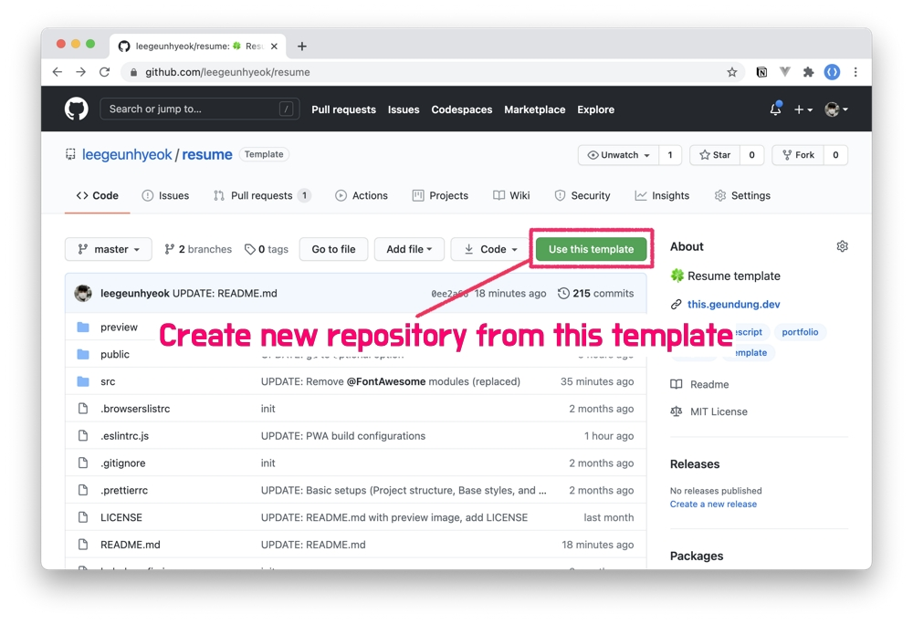
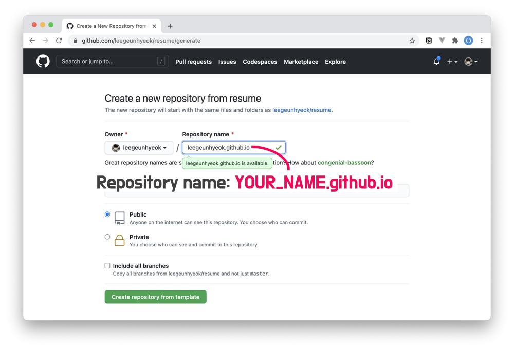

# Deploy - GitHub Page

## 1. Create GitHub repository





## 2. Clone craeted repository

- Configuration your own template data - [Template configuration](https://github.com/leegeunhyeok/resume#-template-configuration)

## 3. Build

```bash
# Install dependencies
npm install

# Build for GitHub pages
npm run build:github
```

## 4. Commit and Push

```bash
# Staging all changes and commit
git add .
git commit -m "COMMIT MESSAGE"

# Your remote/branch
git push origin master
```

## 5. Enjoy!

🎉 Go to your GitHub pages!
